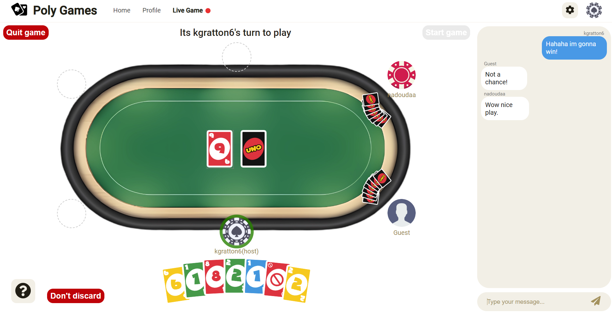
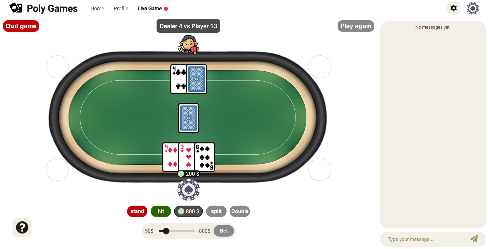

# Poly Games

## Visit the Website

Visit the live version of the project [here](https://www.poly-games.online).

## Overview

Poly Games is an ongoing personal project aimed at developing a full-stack application where users can enjoy playing card games online. The project integrates both front-end and back-end technologies to create a seamless gaming experience, allowing multiple players to connect, play, and interact in real-time.

## 🌟 Features

- **Real-time Communication**: Implements WebSocket for real-time communication between players, ensuring instant updates and seamless interaction during gameplay.
- **Token-based Authentication**: Ensures secure login and session management for users, enhancing the overall security of the application.
- **Django and Angular**: Utilizes Django for the server-side logic and Angular for the client-side interface, providing a robust, responsive, and scalable website.
- **Deployment**: The client side is deployed on Vercel, and the server side is hosted on DigitalOcean.
- **Database**: SQL lite for users information and Redis for rapid interaction and real-time updates in games in process.

## 📸 Project Screenshots

### Uno game example


### Blackjack game example


### Home Page


### Connection Page


### Creating an account Page


### Active tables page


## 🚀 Installation and Setup

To set up the project on your local machine, follow these steps:

1. **Clone the repository**

2. **Navigate to the server directory**:
   ```sh
   cd server
3. **Install the required packages**:
   ```sh
   pip install -r requirements.txt
4. **Apply the migrations to set up the database**:
   ```sh
   python manage.py makemigrations
   python manage.py migrate
5. **Run the server**:
   ```sh
   python manage.py runserver
6. **Navigate to the client directory**:
   ```sh
   cd client
7. **Install the required packages**:
   ```sh
   npm ci
8. **Run the client**:
   ```sh
   npm start
   
## 🛠️Technologies Used


